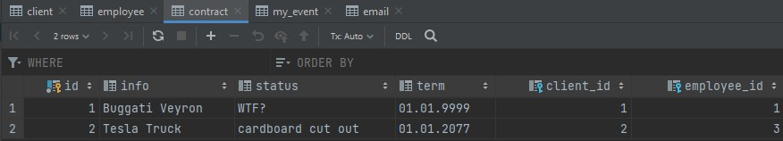

# Laboratory works for Enterprise Systems Architecture (ESA)
## Borisov Dmitriy Sergeevich and Petrov Leonid Andreevich 6133-010402D

This work presents 5 entities: client, employee, contract, my_event, email. The database describes the provision of services between a client and an employee of the company. The provision of the service is described in the Contract entity.

__client__: This entity describes the client data of a place of service provision. A client can have many contracts, but a contract has only one client.

__employee__: This entity describes an employee of a service company. An employee can have many contracts, but the contract has only one employee who performs the service.

__contract__: This entity describes the services provided to the client and executed by the employee.

__my_event__: This entity logs data changes.

__email__: This entity sends a message about the event to the specified e-mails.
